# GEO Hub · 全域内容营销中台

> 选题 · 创作 · 合规 · 分发 · 复盘，一个人跑完全链路。
>
> 一个面向内贸 / 海外双市场的 **GEO（生成式引擎优化）内容营销中台**：把被平台"罚出来"的实战经验固化成系统规则，让每一次内容生产都自带合规护栏。

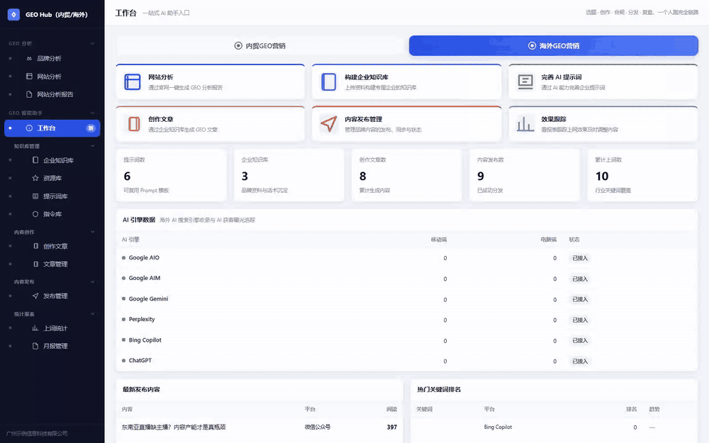

---

## 为什么做这个产品

做新媒体运营时反复遇到三个问题：

1. **内容合规靠人记** —— 哪个平台删文、哪个词违规、AI 生成必须怎么标注，全在老运营脑子里，新人一上来就踩坑；
2. **同一篇内容多渠道分发全靠手工** —— 官网、媒体、博客、海外论坛、垂直 B2B，每个渠道规则不同，重复扣点、重复劳动；
3. **效果无法闭环** —— 文章发出去，有没有被 Google AIO / Perplexity / ChatGPT 这类 AI 引擎引用，没人追踪。

GEO Hub 把这三件事系统化：**合规规则内置进创作与发布流程、渠道矩阵统一调度、AI 引擎收录可视化跟踪**。

## 产品一览

| 工作台 | 品牌分析 | 文章管理 |
|---|---|---|
| 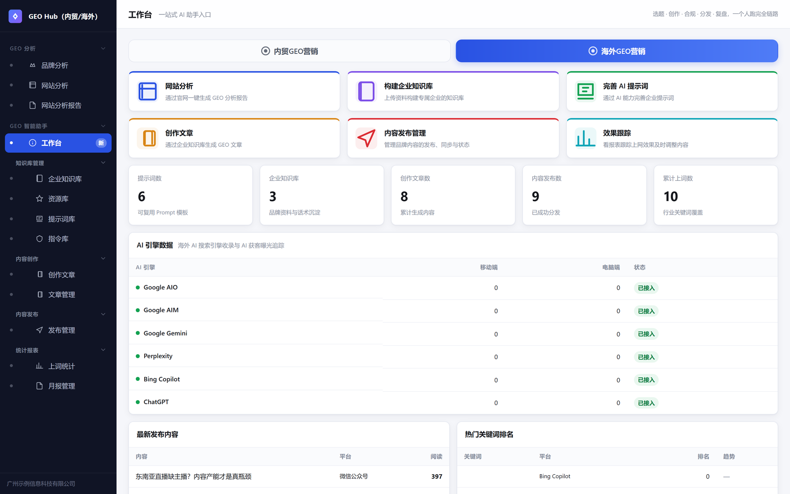 | 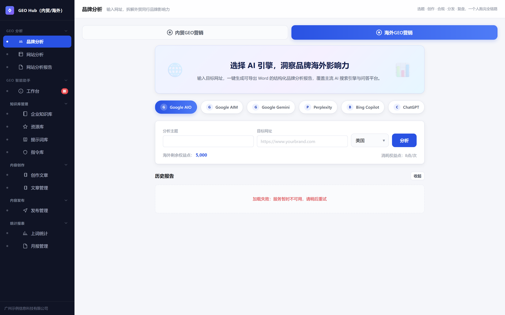 | 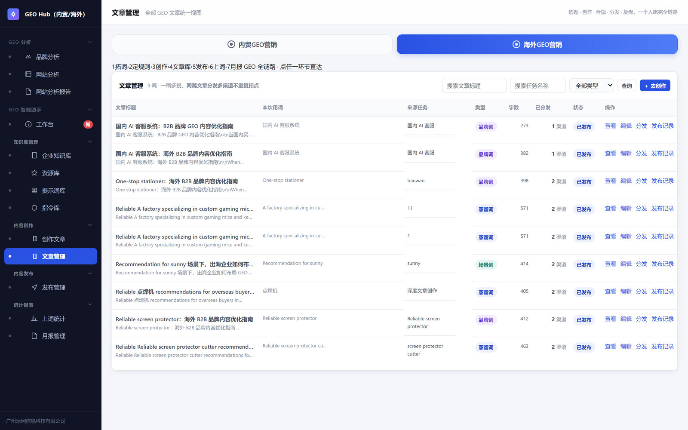 |

| 发布管理（渠道矩阵） | 上词统计 | 月报管理 |
|---|---|---|
| 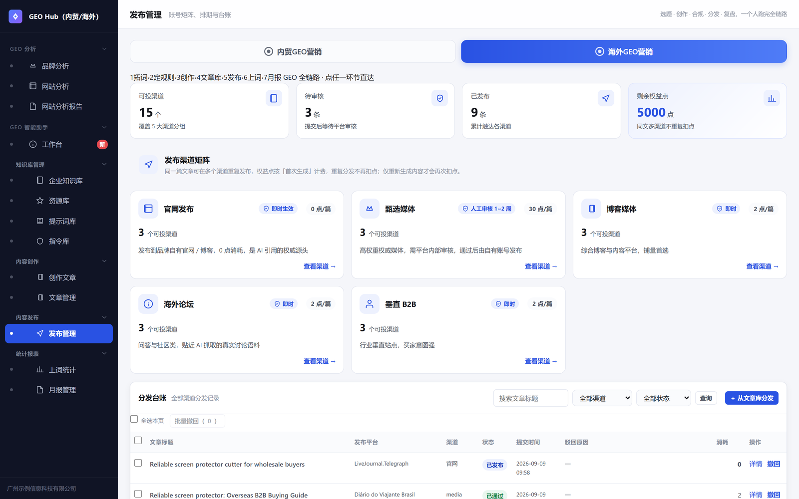 | 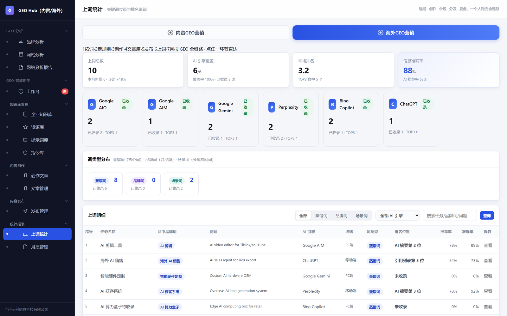 | 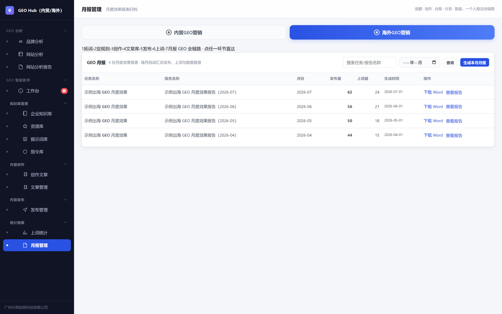 |

<details>
<summary>更多模块截图（知识库 / 提示词库 / 指令库 / 创作文章 / 网站分析报告 / 资源库）</summary>

| 企业知识库 | 提示词库 | 指令库 |
|---|---|---|
| 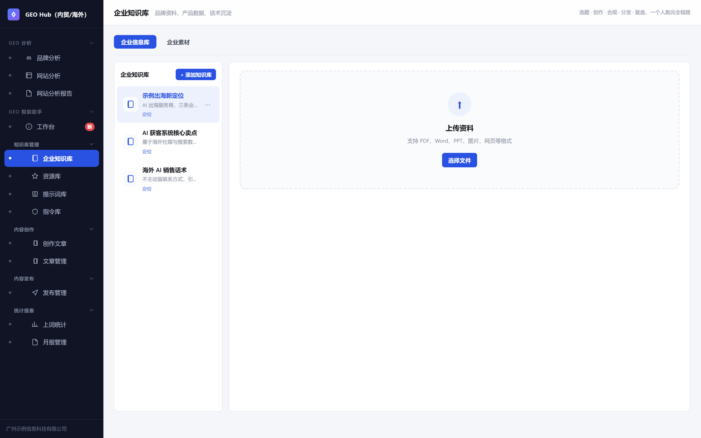 | 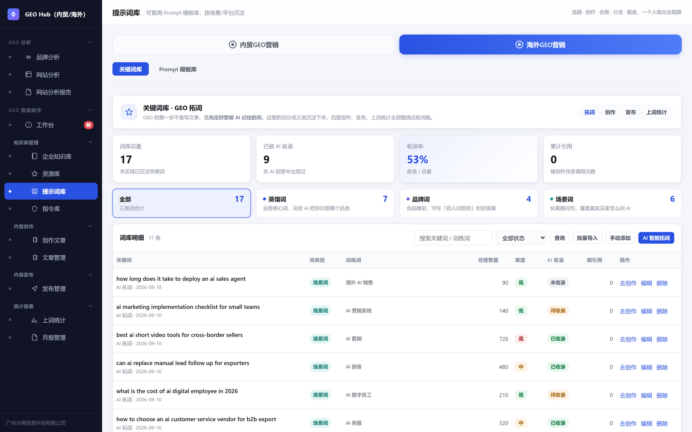 | 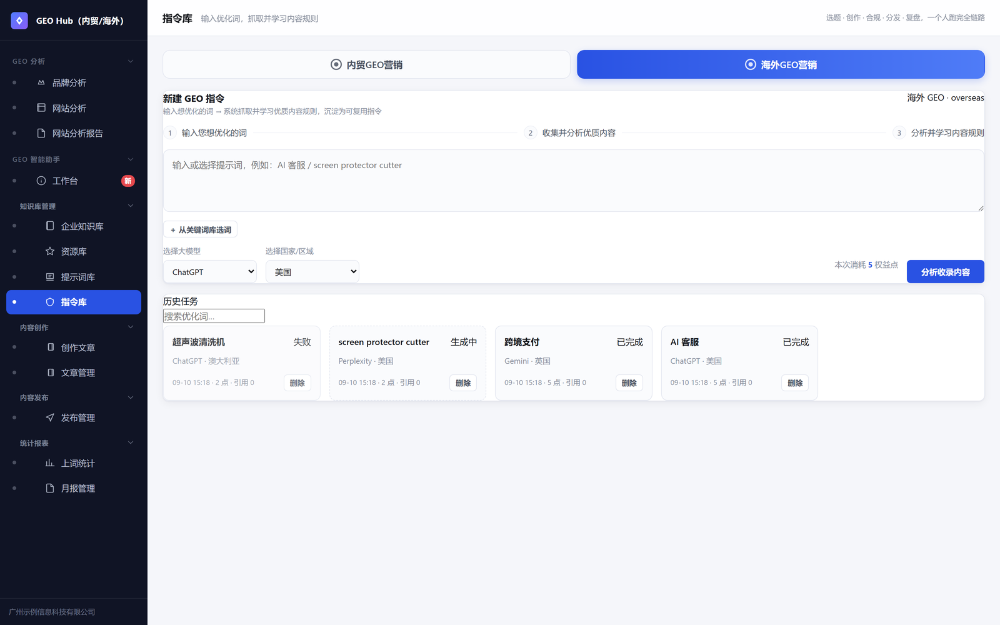 |

| 创作文章 | 网站分析报告 | 资源库 |
|---|---|---|
| 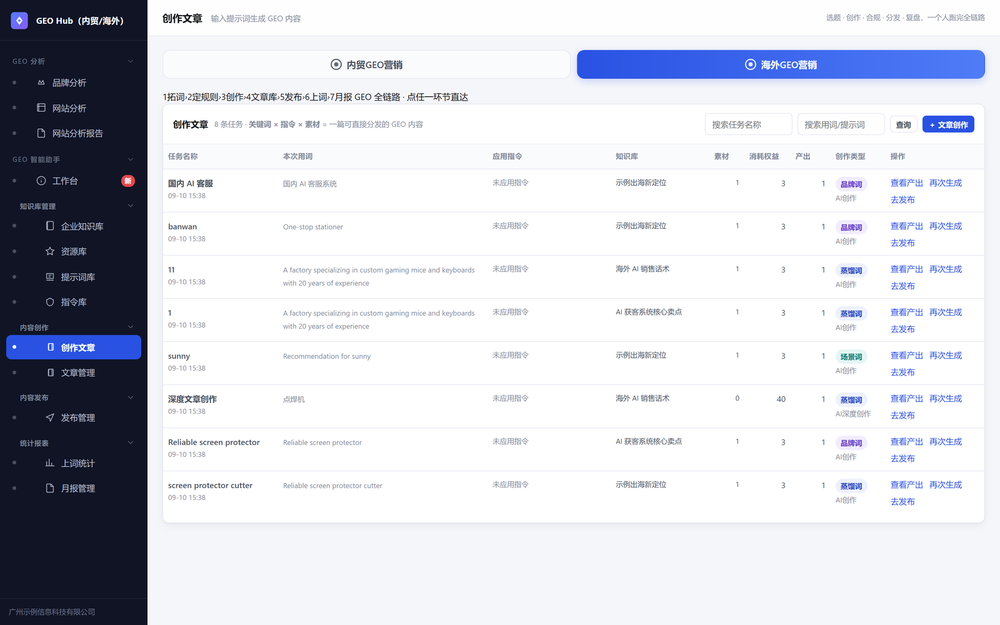 | 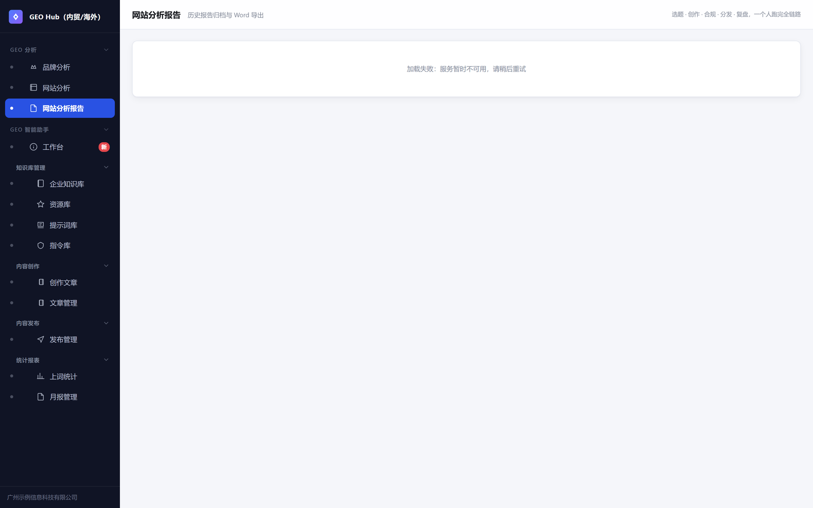 | 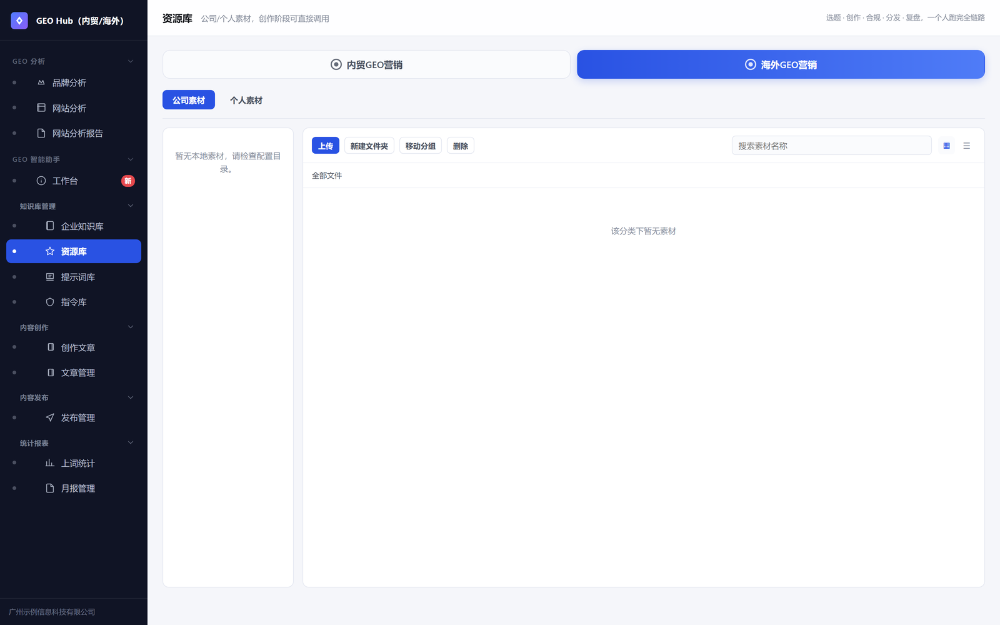 |

</details>

## GEO 全链路

产品围绕一条 7 环节闭环组织，每个环节可独立使用、也可从任一环节直达：

```
拓词 → 定规则 → 创作 → 文章库 → 发布 → 上词 → 月报
```

| 环节 | 模块 | 解决什么 |
|---|---|---|
| 拓词 | 提示词库 | 定好要被 AI 记住的关键词（蒸馏词 / 品牌词 / 场景词） |
| 定规则 | 指令库 | 抓取并学习各平台收录规则，沉淀为可复用指令 |
| 创作 | 创作文章 | 词 × 指令 × 素材 → 生成 GEO 内容 |
| 文章库 | 文章管理 | 统一编辑、多渠道分发、一稿多投不重复扣点 |
| 发布 | 发布管理 | 5 大渠道矩阵、收益点体系、排期与台账、可撤回 |
| 上词 | 上词统计 | 跟踪关键词在 AI 引擎的收录与排名 |
| 复盘 | 月报管理 | 月度效果报表，一键导出 Word |

## 核心设计决策

### 1. 合规护栏是系统规则，不是制度文档
内置 P0/P1 分级规则引擎。例如 `AI_DECLARE`（P0 法律红线）：所有 AI 参与生成的内容必须包含 AI 生成声明并开启平台标识 —— 依据《人工智能生成合成内容标识办法》，漏标存在下架与账号处罚风险。规则在**创作阶段**就介入预检，而不是发布后被删才复盘。

### 2. 渠道矩阵 + 收益点体系
同一篇文章可分发到官网 / 甄选媒体 / 博客媒体 / 海外论坛 / 垂直 B2B 五大类渠道。「原生生成」与「计算生成」区分计费收益点，同文章多渠道不重复扣点，从机制上防止刷量。

### 3. AI 引擎收录跟踪
工作台直接展示 Google AIO、Google AIM、Gemini、Perplexity、Bing Copilot、ChatGPT 六大 AI 引擎的收录状态与曝光趋势 —— 这是 GEO（生成式引擎优化）区别于传统 SEO 的核心指标。

### 4. 内贸 / 海外双市场
同一套系统两种打法：内贸 GEB 营销与海外 GEO 全链路，区域级数据隔离。

## 技术架构

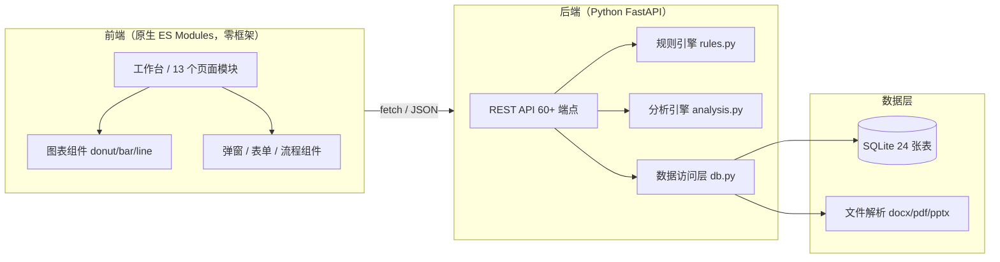

- **后端**：Python · FastAPI · SQLite（24 张表，含 FTS 检索）· 60+ REST 端点
- **前端**：原生 ES Modules + 自研轻量组件库（弹窗、图表、流程条），零框架依赖
- **文档处理**：python-docx / PyPDF2 / python-pptx（知识库多格式摄取，报告 Word 导出）
- **部署**：Docker 化交付，启动自动播种演示数据

## 工程量

| 指标 | 数量 |
|---|---|
| 后端 Python | ~4,000 行（main 2,157 / seed 962 / db 428 / analysis 282 / rules 208） |
| 前端 JS | ~4,500 行（9 个模块） |
| REST API | 60+ 端点 |
| 数据表 | 24 张 |
| 产品页面 | 13 个功能模块 |
| 内置合规规则 | 16 条（P0-P2 分级） |

## 关于代码

核心代码因商业保密暂不公开（本仓库为产品展示）。技术方案、架构与实现细节欢迎面试现场交流演示。

> 本仓库所有数据均为脱敏演示数据，不含任何真实客户与业务信息。
